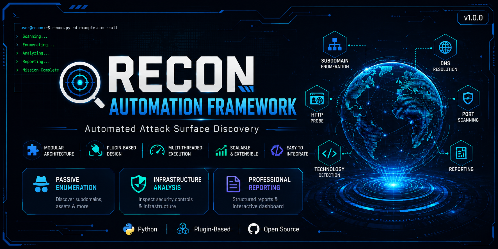
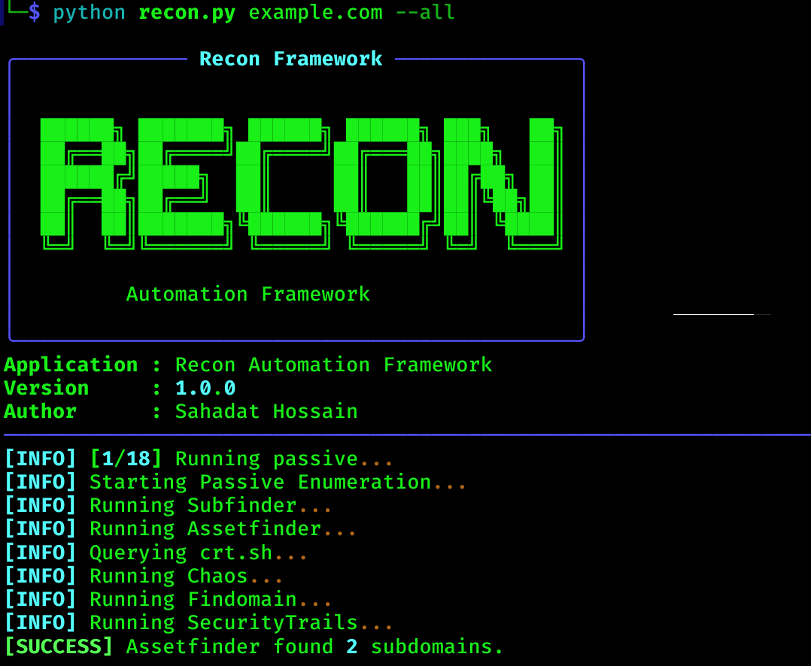
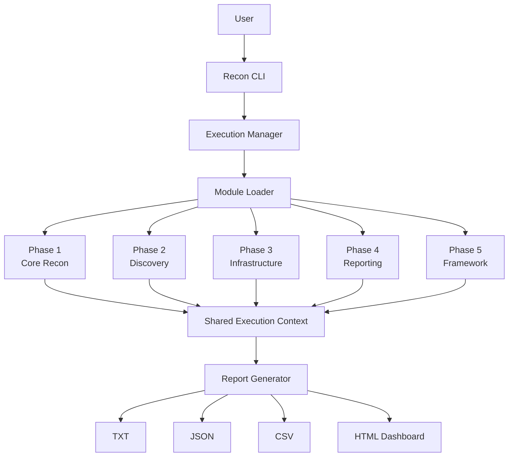
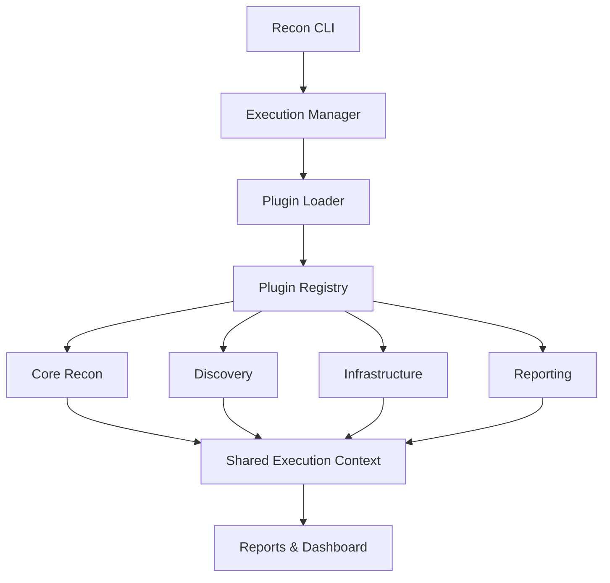
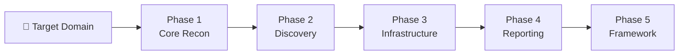
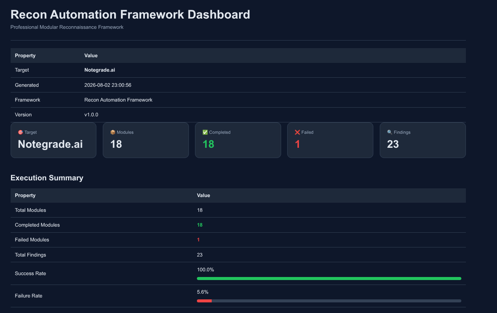
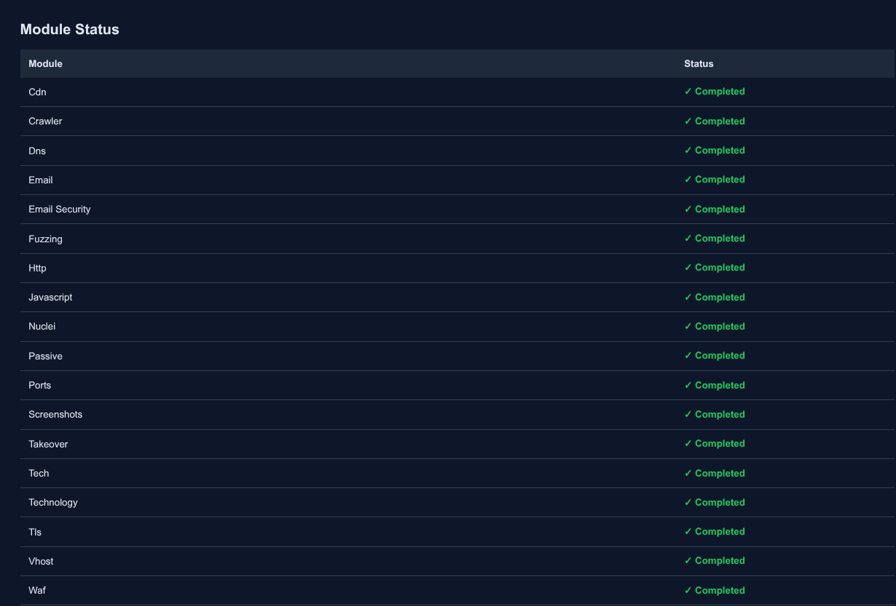
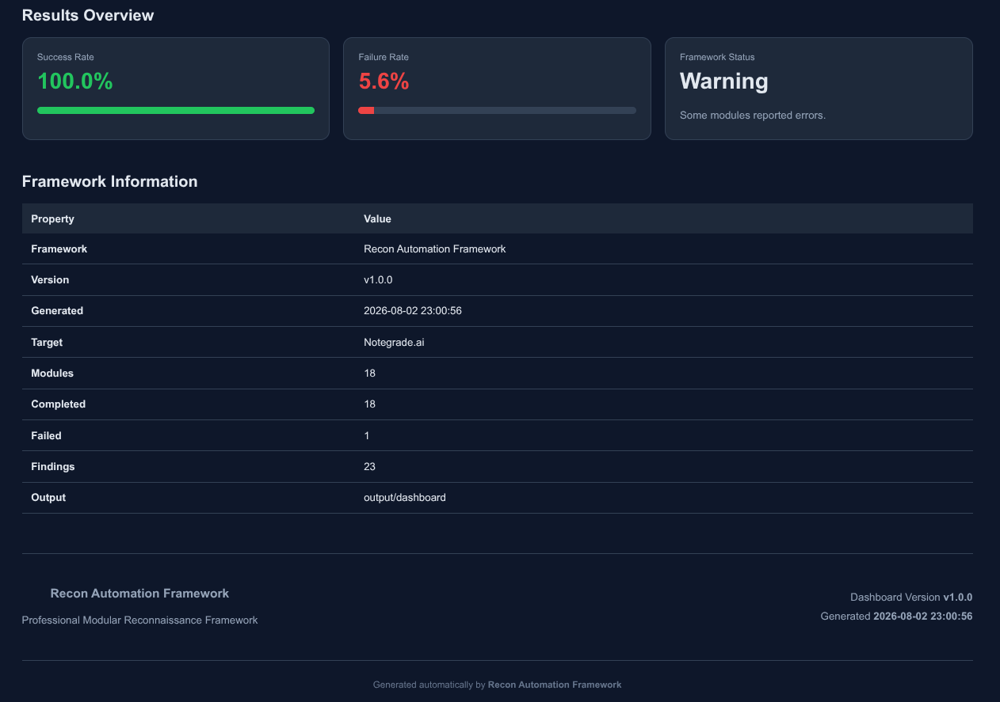
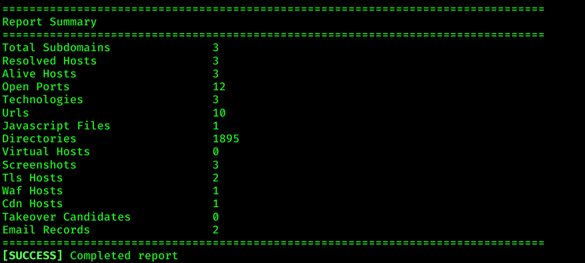
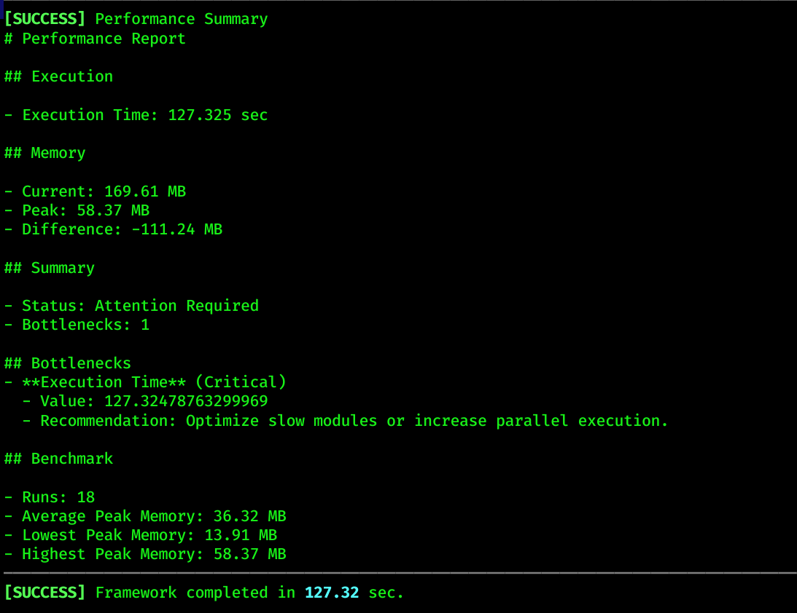

<!-- ========================================================= -->
<!-- Hero Banner -->
<!-- ========================================================= -->

<h1 align="center">
🔍 Recon Automation Framework
</h1>

<p align="center">
<strong>A Modular, Plugin-Based Reconnaissance Framework for Automated Attack Surface Discovery</strong>
</p>

<p align="center">
Automated Reconnaissance • Plugin Architecture • Multi-threading • Professional Reporting
</p>

<p align="center">
  
</p>

<!-- ========================================================= -->
<!-- GitHub Badges -->
<!-- ========================================================= -->

<p align="center">


</p>

<p align="center">


</p>

---

<p align="center">

Recon Automation Framework is an open-source, modular, and plugin-based reconnaissance framework designed to automate attack surface discovery for penetration testing, bug bounty hunting, and security assessments.

Built around a modular plugin architecture, it integrates reconnaissance, web discovery, infrastructure analysis, and professional reporting into a unified and extensible workflow.

</p>

---

<!-- ========================================================= -->
<!-- Overview -->
<!-- ========================================================= -->

# 📖 Overview

Recon Automation Framework provides a complete, phase-based reconnaissance workflow that automates the collection, analysis, and reporting of attack surface intelligence.

The framework combines passive enumeration, infrastructure analysis, web application discovery, and professional reporting through a modular plugin architecture. Each module operates independently while sharing a common execution context, enabling reliable automation, easy extensibility, and consistent data flow across the entire reconnaissance pipeline.

Whether performing penetration testing, bug bounty reconnaissance, or general security assessments, the framework streamlines repetitive reconnaissance tasks and produces structured, actionable results in multiple output formats.

---

<p align="right">
<a href="#recon-automation-framework">⬆️ Back to Top</a>
</p>

<!-- ========================================================= -->
<!-- Design Principles -->
<!-- ========================================================= -->

# ⚙️ Design Principles

Recon Automation Framework is built on a set of core engineering principles that ensure the framework remains modular, scalable, and easy to maintain as new reconnaissance capabilities are added.

---

## 🧩 Modular Architecture

Each reconnaissance capability is implemented as an independent module with a single responsibility, making the framework easier to develop, test, and maintain.

---

## 🔌 Plugin-Based Design

New modules can be integrated without modifying the core framework, allowing the project to grow while keeping the codebase clean and stable.

---

## ⚡ Performance

The framework leverages multi-threading and optimized execution pipelines to improve scan speed while maintaining reliable results.

---

## 📈 Scalability

Supports both local execution and future distributed deployments.

---

## 🛠️ Maintainability

A consistent project structure, reusable components, and clear separation of responsibilities simplify long-term maintenance and future development.

---

## 💡 Design Philosophy

> **Build once. Extend forever.**

Every component is designed to be reusable, independent, and easy to extend without affecting existing functionality.


<!-- ========================================================= -->
<!-- Table of Contents -->
<!-- ========================================================= -->

# 📑 Table of Contents
- [📖 Overview](#-overview)
- [🎬 Demo](#-demo)

- [✨ Features](#-features)
- [⚙️ Design Principles](#️-design-principles)

- [🏗️ Framework Architecture](#️-framework-architecture)
- [🔌 Plugin Architecture](#-plugin-architecture)
- [🔄 Recon Pipeline](#-recon-pipeline)

- [📦 Supported Modules](#-supported-modules)
  - [Phase 1 — Core Recon](#phase-1--core-recon)
  - [Phase 2 — Discovery](#-phase-2--discovery)
  - [Phase 3 — Infrastructure](#-phase-3--infrastructure)
  - [Phase 4 — Reporting](#-phase-4--reporting)
  - [Phase 5 — Framework](#-phase-5--framework)

- [📁 Project Structure](#-project-structure)

- [🛠️ Installation](#️-installation)
- [⚙️ Configuration](#️-configuration)
- [🚀 Usage](#-usage)

- [📂 Output](#-output)
- [📸 Screenshots](#-screenshots)

- [🗺️ Roadmap](#️-roadmap)
- [🤝 Contributing](#-contributing)
- [📄 License](#-license)
- [👨‍💻 Author](#-author)


<!-- ========================================================= -->
<!-- Demo -->
<!-- ========================================================= -->

# 🎬 Demo

The following screenshot demonstrates the framework's command-line interface during a reconnaissance workflow.

---

## 💻 Command-Line Interface

The framework provides a clean and informative CLI with:

- Real-time module execution
- Colored logging
- Progress tracking
- Execution statistics
- Automatic report generation

<p align="center">
  
</p>

Example Command:

```bash
python recon.py example.com --all
```

---

<p align="right">
  <a href="#recon-automation-framework">⬆️ Back to Top</a>
</p>


<!-- ========================================================= -->
<!-- Features -->
<!-- ========================================================= -->

# ✨ Features

Recon Automation Framework provides a complete reconnaissance workflow through a modular, extensible, and plugin-based architecture.

---

## ⚙️ Framework Capabilities

- Modular Plugin-Based Architecture
- 17 Specialized Reconnaissance Modules
- Automated Phase-Based Reconnaissance Pipeline
- Multi-threaded Module Execution
- Interactive HTML Dashboard
- Multi-format Report Generation (HTML, JSON, CSV, TXT, Markdown)

---

<p align="right">
  <a href="#recon-automation-framework">⬆️ Back to Top</a>
</p>


<!-- ========================================================= -->
<!-- Framework Architecture -->
<!-- ========================================================= -->

# 🏗️ Framework Architecture

Recon Automation Framework organizes reconnaissance tasks into independent modules coordinated through a shared execution context.

---



The following diagram illustrates how requests flow through the framework from execution to reporting.

---

## 🔄 Execution Flow

Every module follows the same execution pipeline.

```text
User
   │
   ▼
CLI
   │
   ▼
Execution Manager
   │
   ▼
Module Loader
   │
   ▼
Selected Module
   │
   ▼
Shared Context
   │
   ▼
Report Generator
   │
   ▼
TXT / JSON / CSV / HTML
```

---

<p align="right">
  <a href="#recon-automation-framework">⬆️ Back to Top</a>
</p>


<!-- ========================================================= -->
<!-- Plugin Architecture -->
<!-- ========================================================= -->

# 🔌 Plugin Architecture

Each reconnaissance capability is packaged as an independent plugin that can be discovered, loaded, and executed by the framework.

---

## Plugin Lifecycle



---

<p align="right">
  <a href="#recon-automation-framework">⬆️ Back to Top</a>
</p>


<!-- ========================================================= -->
<!-- Recon Pipeline -->
<!-- ========================================================= -->

# 🔄 Recon Pipeline

Recon Automation Framework executes reconnaissance through a structured, phase-based pipeline. Each phase consumes the output of the previous stage and produces structured results for the next, enabling a consistent and automated reconnaissance workflow.

## Pipeline Overview



## Phase Breakdown

| Phase | Modules |
|--------|---------|
| **Phase 1 — Core Recon** | Passive Enumeration, DNS Resolution, HTTP Probe, Port Scanner, Technology Detection, Screenshot Capture |
| **Phase 2 — Discovery** | URL Discovery, JavaScript Analysis, Directory Fuzzing, Virtual Host Discovery |
| **Phase 3 — Infrastructure** | TLS Analysis, WAF Detection, CDN Detection, Takeover Detection, Email Security |
| **Phase 4 — Reporting** | Report Generator, HTML Dashboard |
| **Phase 5 — Framework** | Command-Line Interface, Plugin System, Performance Monitoring, Dashboard Generation |

## ✨ Pipeline Benefits

- Phase-based reconnaissance workflow
- Modular execution across all modules
- Consistent data flow between phases
- Easy integration of new modules
- Automated report generation
- Scalable and extensible architecture

---

<p align="right">
<a href="#recon-automation-framework">⬆️ Back to Top</a>
</p>

<!-- ========================================================= -->
<!-- Project Structure -->
<!-- ========================================================= -->

# 📁 Project Structure

Recon Automation Framework is organized into independent components that separate the framework core, reconnaissance modules, configuration, and generated outputs. This structure keeps the codebase modular, maintainable, and easy to extend.

## Repository Structure

```text
Recon-Automation-Framework/
│
├── cli/                     # Command-line interface
├── config/                  # Framework configuration
├── core/                    # Core framework components
├── modules/                 # Reconnaissance modules
├── output/                  # Generated reports and results
├── wordlists/               # Fuzzing wordlists
│
├── recon.py                 # Framework entry point
├── requirements.txt         # Python dependencies
├── README.md
└── LICENSE
```

## Module Organization

```text
modules/
├── passive/
├── dns/
├── http/
├── ports/
├── tech/
├── screenshots/
├── crawler/
├── javascript/
├── fuzzing/
├── vhost/
├── tls/
├── waf/
├── cdn/
├── takeover/
├── email/
├── report/
└── dashboard/
```

## Standard Module Layout

Each module follows a consistent internal structure, making development, testing, and maintenance straightforward.

```text
module/
├── analyzer.py
├── constants.py
├── exporter.py
├── helpers.py
├── manager.py
├── plugin.py
├── statistics.py
└── ...
```

---

<p align="right">
<a href="#recon-automation-framework">⬆️ Back to Top</a>
</p>


<!-- ========================================================= -->
<!-- Supported Modules -->
<!-- ========================================================= -->

# 📦 Supported Modules

The framework includes dedicated modules for reconnaissance, discovery, infrastructure analysis, reporting, and framework management.

| Phase | Modules | Included Components |
|--------|:------:|---------------------|
| **Phase 1 — Core Recon** | **6** | Passive, DNS, HTTP, Ports, Technology, Screenshots |
| **Phase 2 — Discovery** | **4** | Crawler, JavaScript, Fuzzing, VHost |
| **Phase 3 — Infrastructure** | **5** | TLS, WAF, CDN, Takeover, Email |
| **Phase 4 — Reporting** | **2** | Report, Dashboard |
| **Phase 5 — Framework** | **4 Core** | Command-Line Interface, Plugin System, Performance Monitoring, Dashboard Generation |

---

## Phase 1 — Core Recon

### 🌐 Passive Enumeration

Passive Enumeration discovers subdomains and publicly available assets without directly interacting with the target infrastructure. It gathers information from multiple external intelligence sources while minimizing noise through normalization and deduplication.

#### Features

- Multi-source subdomain enumeration
- Certificate Transparency log analysis
- Public intelligence collection
- Result normalization and deduplication
- Automated export of discovered assets

#### Example

```bash
python recon.py example.com --passive
```

---

### 🌍 DNS Resolution

DNS Resolution validates discovered subdomains by resolving DNS records and collecting information required by subsequent reconnaissance modules.

#### Features

- Multi-threaded DNS resolution
- Record validation
- Fast lookup processing
- Structured result generation

#### Example

```bash
python recon.py example.com --dns
```

---

### 🌐 HTTP Probe

HTTP Probe verifies which hosts are reachable over HTTP or HTTPS and collects response metadata for further analysis.

#### Features

- HTTP/HTTPS validation
- Status code detection
- Response metadata collection
- Redirect handling
- Title extraction

#### Example

```bash
python recon.py example.com --http
```

---

### 📸 Screenshot Capture

Screenshot Capture generates visual previews of live web applications to simplify manual analysis and asset identification.

#### Features

- Asynchronous screenshot capture
- Full-page rendering
- Automatic page title extraction
- High-resolution image generation
- Organized screenshot storage

#### Example

```bash
python recon.py example.com --screenshots
```

---

### 🔓 Port Scanner

Port Scanner identifies open network ports and running services across discovered hosts using concurrent scanning techniques.

#### Features

- TCP port scanning
- Multi-threaded execution
- Service identification
- Configurable port ranges
- Structured scan results

#### Example

```bash
python recon.py example.com --ports
```

---

### 🛠️ Technology Detection

Technology Detection fingerprints web technologies used by target applications, providing insight into the underlying software stack.

#### Features

- CMS detection
- Web server identification
- Programming language detection
- JavaScript framework detection
- Library and technology fingerprinting

#### Example

```bash
python recon.py example.com --tech
```

---

<p align="right">
<a href="#recon-automation-framework">⬆️ Back to Top</a>
</p>


<!-- ========================================================= -->
<!-- Phase 2 — Discovery -->
<!-- ========================================================= -->

## 🔍 Phase 2 — Discovery

The Discovery phase expands the identified attack surface by analyzing web applications, extracting hidden resources, and discovering additional entry points for security assessment.

---

### 🔗 URL Discovery

URL Discovery crawls target web applications to collect publicly accessible URLs and identify content that may be valuable for further analysis.

#### Features

- Recursive web crawling
- URL normalization
- Internal link discovery
- JavaScript file collection
- Structured URL export

#### Example

```bash
python recon.py example.com --crawl
```

---

### 📜 JavaScript Analysis

JavaScript Analysis downloads and analyzes JavaScript files to identify endpoints, hidden resources, secrets, and other information useful during reconnaissance.

#### Features

- JavaScript download and parsing
- Endpoint extraction
- URL discovery
- Source map detection
- Secret detection
- Interesting file and directory identification
- Structured report generation

#### Example

```bash
python recon.py example.com --javascript
```

---

### 📂 Directory Fuzzing

Directory Fuzzing discovers hidden files and directories by testing common paths against the target web server.

#### Features

- Multi-threaded fuzzing
- Configurable wordlists
- Recursive directory discovery
- Response filtering
- Status code analysis

#### Example

```bash
python recon.py example.com --fuzz
```

---

### 🌍 Virtual Host Discovery

Virtual Host Discovery identifies additional virtual hosts configured on the target web server that may not be publicly referenced.

#### Features

- Virtual host enumeration
- Host header fuzzing
- Response comparison
- Hidden application discovery
- Multi-threaded execution

#### Example

```bash
python recon.py example.com --vhost
```

---

<!-- ========================================================= -->
<!-- Phase 3 — Infrastructure -->
<!-- ========================================================= -->

## 🌐 Phase 3 — Infrastructure

The Infrastructure phase analyzes security controls and infrastructure components to provide a better understanding of the target environment.

---

### 🔐 TLS Analysis

TLS Analysis inspects SSL/TLS configurations to identify supported protocols, certificates, and security settings.

#### Features

- SSL/TLS inspection
- Certificate analysis
- Supported protocol detection
- Cipher suite collection
- Expiration monitoring

#### Example

```bash
python recon.py example.com --tls
```

---

### 🛡️ WAF Detection

WAF Detection identifies Web Application Firewalls protecting the target by analyzing HTTP responses and response patterns.

#### Features

- Automatic WAF fingerprinting
- Response header analysis
- Signature-based detection
- Vendor identification

#### Supported Vendors

- Cloudflare
- Akamai
- Imperva
- AWS WAF
- F5 BIG-IP
- FortiWeb
- Azure WAF

#### Example

```bash
python recon.py example.com --waf
```

---

### ☁️ CDN Detection

CDN Detection determines whether the target is served through a Content Delivery Network.

#### Features

- CDN fingerprinting
- Response header analysis
- IP range validation
- Provider identification

#### Supported Providers

- Cloudflare
- CloudFront
- Fastly
- Akamai
- BunnyCDN
- Azure CDN

#### Example

```bash
python recon.py example.com --cdn
```

---

### ⚠️ Takeover Detection

Takeover Detection checks for potential subdomain takeover opportunities by identifying dangling DNS records and unclaimed third-party services.

#### Features

- Service fingerprinting
- CNAME validation
- Dangling DNS detection
- Takeover signature matching

#### Supported Services

- GitHub Pages
- AWS S3
- Heroku
- Netlify
- Vercel
- Azure
- Shopify

#### Example

```bash
python recon.py example.com --takeover
```

---

### 📧 Email Security

Email Security analyzes DNS records related to email authentication and protection mechanisms.

#### Features

- SPF validation
- DKIM detection
- DMARC analysis
- MX record inspection
- Mail server identification

#### Example

```bash
python recon.py example.com --email
```

---

<!-- ========================================================= -->
<!-- Phase 4 — Reporting -->
<!-- ========================================================= -->

## 📊 Phase 4 — Reporting

The Reporting module consolidates reconnaissance results into structured reports and an interactive dashboard for easier analysis and documentation.

### Reporting & Dashboard

#### Features

- TXT report generation
- JSON export
- CSV export
- Markdown report
- Interactive HTML dashboard
- Consolidated scan summary

#### Supported Formats

| Format | Supported |
|---------|:---------:|
| TXT | ✅ |
| JSON | ✅ |
| CSV | ✅ |
| Markdown | ✅ |
| HTML Dashboard | ✅ |

#### Example

```bash
python recon.py example.com --report
```

---

<!-- ========================================================= -->
<!-- Phase 5 — Framework -->
<!-- ========================================================= -->

## 🚀 Phase 5 — Framework

The Framework phase provides the core services that coordinate module execution, plugin management, performance optimization, and dashboard generation.

#### Components

- Command-Line Interface
- Plugin System
- Performance Monitoring
- Dashboard Generation

#### Responsibilities

- Coordinate module execution
- Manage plugin lifecycle
- Track execution statistics
- Generate reports and dashboards
- Optimize framework performance

---

<p align="right">
<a href="#recon-automation-framework">⬆️ Back to Top</a>
</p>


<!-- ========================================================= -->
<!-- Installation -->
<!-- ========================================================= -->

# 🛠️ Installation

Follow the steps below to install and run Recon Automation Framework.

## Requirements

- Python 3.11+
- Git
- Linux (Recommended)
- Playwright (Optional, required only for the Screenshot Capture module)

## Clone the Repository

```bash
git clone https://github.com/sahadatx/Recon-Automation-Framework.git

cd Recon-Automation-Framework
```

## Create a Virtual Environment

### Linux

```bash
python3 -m venv venv
source venv/bin/activate
```

### Windows

```powershell
python -m venv venv
venv\Scripts\activate
```

## Install Dependencies

```bash
pip install --upgrade pip
pip install -r requirements.txt
```
## Install Playwright (Optional)

Required only for the Screenshot Capture module.

```bash
python -m playwright install
```

## Verify Installation

```bash
python recon.py --help
```

---

<p align="right">
<a href="#recon-automation-framework">⬆️ Back to Top</a>
</p>

<!-- ========================================================= -->
<!-- Configuration -->
<!-- ========================================================= -->

# ⚙️ Configuration

Configure API keys and framework settings before running reconnaissance modules.

## Environment Variables

Create a `.env` file in the project root.

```env
PDCP_API_KEY=your_pdcp_api_key
SECURITYTRAILS_API_KEY=your_securitytrails_api_key
SHODAN_API_KEY=your_shodan_api_key
```

## Configuration Files

Framework settings are located in:

```text
config/
├── config.py
└── settings.py
```

## Supported Providers

- ProjectDiscovery Chaos
- SecurityTrails
- Shodan

---

<p align="right">
<a href="#recon-automation-framework">⬆️ Back to Top</a>
</p>

<!-- ========================================================= -->
<!-- Usage -->
<!-- ========================================================= -->

# 🚀 Usage

Run individual modules or execute the complete reconnaissance pipeline.

## Quick Start

Run the complete reconnaissance workflow.

```bash
python recon.py example.com --all
```

---

## Run Individual Modules

```bash
python recon.py example.com --dns
python recon.py example.com --http
python recon.py example.com --tech
```

## Help

```bash
python recon.py --help
```

---

<p align="right">
<a href="#recon-automation-framework">⬆️ Back to Top</a>
</p>

<!-- ========================================================= -->
<!-- Output -->
<!-- ========================================================= -->

# 📂 Output

Reconnaissance artifacts are stored in a structured output directory, making results easy to review, analyze, and integrate into subsequent security workflows.

```text
output/
│
├── reports/
│   ├── report.txt
│   ├── report.json
│   ├── report.csv
│   └── report.md
│
├── dashboard/
│   ├── index.html
│   ├── dashboard.json
│   ├── dashboard.txt
│   └── summary.txt
│
├── screenshots/
│   ├── *.png
│   └── ...
│
└── logs/
    └── framework.log
```

---

<p align="right">
<a href="#recon-automation-framework">⬆️ Back to Top</a>
</p>


<!-- ========================================================= -->
<!-- Screenshots -->
<!-- ========================================================= -->

# 📸 Screenshots

The following screenshots showcase the framework interface, dashboard, reports, and performance metrics.

---

## Screenshot 01 — Command-Line Interface

<p align="center">

</p>

---

## Screenshot 02 — Dashboard Overview

<p align="center">

</p>

---

## Screenshot 03 — Dashboard: Module Status

<p align="center">

</p>

---

## Screenshot 04 — Dashboard: Results Overview

<p align="center">

</p>

---

## Screenshot 05 — Generated Report

<p align="center">

</p>

---

## Screenshot 06 — Performance Metrics

<p align="center">

</p>

---

<p align="right">
<a href="#recon-automation-framework">⬆️ Back to Top</a>
</p>


<!-- ========================================================= -->
<!-- Roadmap -->
<!-- ========================================================= -->

# 🗺️ Roadmap

The following enhancements are planned for future releases to improve functionality, scalability, and usability.

## Planned Features

- Docker Support
- REST API
- Web Interface
- Distributed Scanning
- Threat Intelligence Integration
- AI-Assisted Analysis
- Plugin Marketplace
- Enhanced Reporting

---

<p align="right">
<a href="#recon-automation-framework">⬆️ Back to Top</a>
</p>

<!-- ========================================================= -->
<!-- FAQ -->
<!-- ========================================================= -->

# ❓ Frequently Asked Questions

### Which operating systems are supported?

Recon Automation Framework supports Linux and Windows. Linux is recommended for the best compatibility and performance.

---

### Are API keys required?

API keys are optional. Some passive reconnaissance providers require them, while most modules can operate without additional configuration.

---

### Does the framework support custom plugins?

Yes. The modular architecture allows new reconnaissance modules to be integrated with minimal changes to the framework.

---

### What output formats are supported?

The framework generates results in TXT, JSON, CSV, Markdown, and interactive HTML dashboard formats.

---

### Is this framework intended for authorized security testing only?

Yes. This framework is intended for educational purposes and authorized security assessments only. Always obtain proper permission before scanning or testing systems you do not own.

---


<p align="right">
<a href="#recon-automation-framework">⬆️ Back to Top</a>
</p>

<!-- ========================================================= -->
<!-- Contributing -->
<!-- ========================================================= -->

# 🤝 Contributing

Contributions are welcome and appreciated. Whether you are fixing bugs, improving documentation, or adding new features, your contributions help make the project better.

## Getting Started

1. Fork the repository.
2. Create a new feature branch.
3. Commit your changes.
4. Push the branch to your fork.
5. Open a Pull Request.

## Guidelines

- Follow PEP 8 coding standards.
- Write clear and descriptive commit messages.
- Update documentation when necessary.
- Include tests for new functionality whenever possible.

---

<p align="right">
<a href="#recon-automation-framework">⬆️ Back to Top</a>
</p>

<!-- ========================================================= -->
<!-- License -->
<!-- ========================================================= -->

# 📄 License

This project is licensed under the **MIT License**.

See the [LICENSE](LICENSE) file for complete license information.

---

<p align="right">
<a href="#recon-automation-framework">⬆️ Back to Top</a>
</p>

<!-- ========================================================= -->
<!-- Acknowledgements -->
<!-- ========================================================= -->

# 🙏 Acknowledgements

Recon Automation Framework is built on the outstanding work of the open-source cybersecurity community. We sincerely appreciate the developers, maintainers, and contributors whose projects and libraries have made modern reconnaissance, security research, and automation more accessible.

## Open-Source Security Projects

Special thanks to the following projects for providing reliable tools and inspiration throughout the development of this framework:

- **ProjectDiscovery** — Subfinder, Chaos, httpx, Naabu, Katana, Nuclei
- **OWASP** — Open Web Application Security Project
- **Amass** — Network mapping and attack surface discovery
- **Assetfinder** — Passive asset enumeration
- **FFUF** — Fast web fuzzing
- **Wappalyzer** — Web technology fingerprinting

## Python Libraries

This project also relies on several excellent Python libraries:

- **Requests** — HTTP client
- **Rich** — Terminal formatting and progress visualization
- **BeautifulSoup** — HTML parsing
- **Jinja2** — Template rendering
- **Plotly** — Interactive data visualization

---

Open-source software thrives through collaboration, knowledge sharing, and community contributions. We gratefully acknowledge everyone who develops, maintains, and supports these projects, making tools like Recon Automation Framework possible.

---

<p align="right">
<a href="#recon-automation-framework">⬆️ Back to Top</a>
</p>

<!-- ========================================================= -->
<!-- Author -->
<!-- ========================================================= -->

# 👨‍💻 Author

**Sahadat Hossain**

Cybersecurity Researcher • Penetration Tester • Python Developer

### Contact

- 📧 **Email:** pentester.sahadathossain@gmail.com
- 💼 **LinkedIn:** https://www.linkedin.com/in/pentester-sahadat-hossain/
- 🐙 **GitHub:** https://github.com/sahadatx
- 🌐 **Portfolio:** https://sahadatx.github.io/Personal-Portfolio/

> Feel free to connect for collaboration, security research, or open-source contributions.

---

If you found this project useful, consider supporting it by:

- ⭐ Starring the repository
- 🍴 Forking the project
- 🤝 Contributing improvements
- 📢 Sharing it with others

---

<p align="center">
Made with ❤️ by <strong>Sahadat Hossain</strong>
</p>

<p align="right">
<a href="#recon-automation-framework">⬆️ Back to Top</a>
</p>